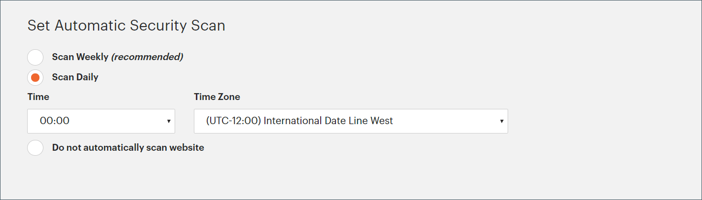

# 보안 검사

Adobe Commerce 보안 검색 도구는 Adobe Commerce 및 Magento Open Source 사이트에 대한 무료 보안 모니터링을 제공합니다. 이 도구는 [account.magento.com](https://account.magento.com/customer/account/login)에서 온라인 Adobe Commerce 계정을 통해 액세스할 수 있는 웹 기반 서비스로 작동합니다.

{width="600" zoomable="yes"}

>[!NOTE]
>
>Adobe은 이 서비스를 무료로 제공하지만, 상인은 검색 결과 및 사이트 구성에 따라 Adobe의 책임을 제한하는 약관에 동의해야 합니다.

## 검사 범위

보안 검색 도구는 HTTP 및 HTTPS 프로토콜을 통해 작동하여 맬웨어를 감지하고 보안 취약점을 식별하며 스토어의 보안 상태를 유지하는 데 도움이 됩니다. 이 도구는 모든 판매자, 개발자 및 사이트 보안을 담당하는 지정 인력이 사용할 수 있습니다.

Security Scan Tool은 안전한 저장소 환경을 유지 관리하는 데 도움이 되는 포괄적인 보안 모니터링 기능을 제공합니다.

- insight을 통해 스토어의 실시간 보안 상태를 확인할 수 있습니다.
- 문제 해결에 도움이 되는 모범 사례를 기반으로 제안을 받습니다.
- 보안 검사를 주별, 일별 또는 온디맨드로 실행하도록 예약합니다.
- 잠재적인 맬웨어를 식별하는 데 도움이 되는 21,000개 이상의 보안 테스트를 실행합니다.
- 사이트의 진행 상황을 추적 및 모니터링하는 기간별 보안 보고서에 액세스합니다.
- 모든 권장 작업과 함께 성공 및 실패한 검사를 표시하는 검사 보고서에 액세스합니다.

>[!NOTE]
>
>Adobe Commerce에 대한 보안 검색 도구 검사에서 특정 보안 테스트를 제외할 수 없습니다. 그러나 해당되는 경우 [실패 무시](#manage-scan-failures)에서 긍정 오류(false positive)로 셀프 서비스를 수행할 수 있습니다.

## 액세스

보안 검색 도구는 사이트 정보를 보호하기 위해 엄격한 액세스 제어 기능을 유지 관리합니다. 이 도구를 사용하려면 Adobe Commerce 계정을 통해 도메인 소유권을 확인해야 하므로 사이트만 검색할 수 있습니다. 각 사이트는 고유한 토큰을 통해 계정에 연결되어 서드파티가 승인하지 않은 검색을 방지합니다.

이 도구는 특히 Adobe Commerce 도메인과 해당 보안 취약점에 중점을 둡니다. 웹 스토어에 다른 플랫폼의 페이지가 포함될 수 있지만 보안 검색 도구는 신뢰할 수 있는 결과를 보장하기 위해 Adobe Commerce 생성 콘텐츠만 스캔해야 합니다. Adobe Commerce이 아닌 페이지를 검색하면 신뢰할 수 없는 취약성 평가가 발생할 수 있습니다.

>[!NOTE]
>
>보안 검색 도구는 다음 공용 IP 주소를 사용합니다.
>
>```text
>52.87.98.44
>34.196.167.176
>3.218.25.102
>```
>
>허용 목록에 추가하다 네트워크 방화벽 규칙에 이러한 IP 주소를 추가하여 도구를 통해 사이트를 스캔할 수 있습니다. 이 도구는 `80` 및 `443` 포트에만 요청을 게시합니다.

## 검사 실행

검색 프로세스는 알려진 보안 문제에 대해 사이트를 확인하고, 스토어를 공격에 취약하게 만들 수 있는 누락된 Adobe Commerce 패치 및 업데이트를 식별합니다.

>[!TIP]
>
>클라우드 인프라 프로젝트의 Commerce에 대해서는 [보안 검색 도구 설정](https://experienceleague.adobe.com/ko/docs/commerce-on-cloud/user-guide/launch/overview#set-up-the-security-scan-tool)을 참조하십시오.

검사를 실행하려면:

1. Commerce 홈페이지에서 [Commerce/Magento 계정](../getting-started/commerce-account-create.md)에 로그인합니다.

1. Security Scan Tool 사용 약관을 검토하고 동의합니다.

   1. 왼쪽 패널에서 **[!UICONTROL Security Scan]**&#x200B;을(를) 선택합니다.
   1. **[!UICONTROL Go to Security Scan]**&#x200B;을(를) 클릭합니다.
   1. **[!UICONTROL Terms and Conditions]**&#x200B;을(를) 읽습니다.
   1. 계속하려면 **[!UICONTROL Agree]**&#x200B;을(를) 클릭하십시오.

1. _[!UICONTROL Monitored Websites]_&#x200B;페이지에서&#x200B;**[!UICONTROL +Add Site]**&#x200B;을(를) 클릭합니다.

   여러 사이트가 있고 도메인이 다른 경우 각 도메인에 대해 별도의 검사를 구성합니다.

   {width="600" zoomable="yes"}

1. 확인 코드를 추가하여 사이트 도메인의 소유권을 확인하려면 다음 중 하나를 수행하십시오.

   **Commerce 상점**:

   1. **[!UICONTROL Site URL]** 및 **[!UICONTROL Site Name]**&#x200B;을(를) 입력하십시오.
   1. **[!UICONTROL Generate Confirmation Code]**&#x200B;을(를) 클릭합니다.
   1. 확인 코드를 클립보드에 복사하려면 **복사**&#x200B;를 클릭하십시오.

      {width="400" zoomable="yes"}

   1. 저장소 관리자에 전체 관리자 권한이 있는 사용자로 로그인하고 다음을 수행합니다.

      1. _관리자_ 사이드바에서 **[!UICONTROL Content]** > _[!UICONTROL Design]_>**[!UICONTROL Configuration]**(으)로 이동합니다.
      1. 목록에서 사이트를 찾은 다음 **[!UICONTROL Edit]**&#x200B;을(를) 클릭합니다.
      1. **[!UICONTROL HTML Head]** 섹션에서 를 확장합니다.
      1. **[!UICONTROL Scripts and Style Sheets]**(으)로 스크롤한 다음 기존 코드의 끝에 있는 텍스트 상자를 클릭합니다. 확인 코드를 텍스트 상자에 붙여 넣습니다.

         {width="600" zoomable="yes"}

      1. 완료되면 **[!UICONTROL Save Configuration]**&#x200B;을(를) 클릭합니다.

   **PWA 상점**:

   1. **[!UICONTROL Site URL]** 및 **[!UICONTROL Site Name]**&#x200B;을(를) 입력하십시오.

   1. **[!UICONTROL Confirmation Code]**&#x200B;에 대해 `META Tag` 옵션을 선택한 다음 **[!UICONTROL Generate Code]**&#x200B;을(를) 클릭합니다.

   1. 생성된 확인 코드 META Tag를 클립보드에 복사하려면 **[!UICONTROL Copy]**&#x200B;을(를) 클릭합니다.

      {width="400" zoomable="yes"}

   1. PWA Studio 상점 프로젝트 디렉토리로 이동하여 다음을 수행합니다.

      1. PWA Studio 프로젝트 디렉터리 아래의 `packages > venia-concept > template.html`(으)로 이동합니다.
      1. 복사된 확인 코드(생성된 META 태그)를 HTML 헤드에 추가하고 변경 사항을 저장합니다.

         {width="600" zoomable="yes"}

      1. PWA Studio CLI로 돌아가서 yarn을 사용하여 프로젝트 종속성을 설치하고 프로젝트 빌드 명령을 실행합니다.

         ```sh
         yarn install &&
         yarn build
         ```

      1. *클라우드 프로젝트에서*&#x200B;을(를) `pwa` 폴더를 만들고 Storefront 프로젝트의 `dist` 폴더 내에 콘텐츠를 복사하세요.

         ```sh
         mkdir pwa && cp -r <path to your storefront project>/dist/* pwa
         ```

      1. Git CLI 도구를 사용하여 이러한 변경 사항을 클라우드 프로젝트에 스테이징하고, 커밋하고, 푸시합니다.

         ```sh
         git add . &&
         git commit -m "Added storefront file bundles" &&
         git push origin
         ```

         빌드 프로세스가 완료되면 변경 사항이 PWA 스토어 전면에 배포됩니다.

1. Commerce 계정의 _[!UICONTROL Security Scan]_&#x200B;페이지로 돌아가서&#x200B;**[!UICONTROL Verify Confirmation Code]**&#x200B;을(를) 클릭하여 도메인의 소유권을 설정합니다.

1. 확인 후 다음 유형 중 하나에 대해 **[!UICONTROL Set Automatic Security Scan]** 옵션을 구성합니다.

   **주별 검사(권장)**:

   매주 검사할 **[!UICONTROL Week Day]**, **[!UICONTROL Time]** 및 **[!UICONTROL Time Zone]**&#x200B;을(를) 선택하십시오.

   기본적으로 스캔은 매주 토요일 자정(UTC)에 시작되고 일요일 초까지 계속되도록 예약되어 있습니다.

   {width="500" zoomable="yes"}

   **매일 검사**:

   매일 검사할 **[!UICONTROL Time]** 및 **[!UICONTROL Time Zone]**&#x200B;을(를) 선택하십시오.

   기본적으로 검색은 매일 자정(UTC)에 시작되도록 예약되어 있습니다.

   {width="500" zoomable="yes"}

1. 완료된 검사 및 보안 업데이트에 대한 알림을 받을 **[!UICONTROL Email Address]**&#x200B;을(를) 입력하십시오.

   {width="400" zoomable="yes"}

1. 완료되면 **[!UICONTROL Submit]**&#x200B;을(를) 클릭합니다.

   도메인의 소유권이 확인되면 사이트가 Commerce 계정의 모니터링되는 웹 사이트 목록에 표시됩니다.

1. 도메인이 다른 여러 웹 사이트가 있는 경우 이 프로세스를 반복하여 각각에 대한 보안 검사를 설정합니다.

## 스캔 실패 관리

보안 검사 도구를 사용하면 보고서 보기에서 직접 검사 오류를 관리할 수 있습니다. 특정 스캔 실패를 긍정 오류(false positive)로 표시하고 위험 점수에서 제외할 수 있습니다.

### 스캔 실패 관리의 이점

스캔 오류를 관리하면 다음과 같은 방법으로 스토어의 보다 정확한 보안 개요를 유지할 수 있습니다.

- 보안 보고서에서 긍정 오류(false positive)를 줄입니다.
- 주의가 필요한 관련 보안 문제에 초점을 맞춥니다.
- 스토어의 실제 보안 상태를 보다 명확하게 파악할 수 있습니다.
- 알려진 긍정 오류(false positive)에 대해 지원 센터에 문의할 필요가 없습니다.
- 이미 조사한 스캔 실패를 자체 관리하여 시간을 절약할 수 있습니다.

검사 실패를 긍정 오류(false positive)로 표시할 수 있는 일반적인 시나리오는 다음과 같습니다.

- 이미 보안 패치를 적용한 경우 검색 도구에서 감지하지 못했습니다.
- 감지된 문제가 특정 스토어 구성에 해당되지 않는 경우.
- 문제를 해결하는 대체 보안 조치를 구현한 경우.
- 스캔 실패가 비즈니스 요구에 맞게 의도적으로 설정한 구성을 기반으로 하는 경우.

### 스캔 실패 무시

긍정 오류(false positive)로 식별한 스캔 실패를 관리하려면 다음 단계를 수행하십시오.

1. _[!UICONTROL Monitored Websites]_&#x200B;페이지에서 관리할 사이트의&#x200B;**[!UICONTROL View Report]**&#x200B;을(를) 클릭합니다.

1. 보고서 보기에서 긍정 오류(false positive)로 표시할 실패한 검사를 찾습니다.

1. 특정 검사 오류에 대해 **[!UICONTROL Ignore]**&#x200B;을(를) 클릭합니다.

   {width="600" zoomable="yes"}

1. 선택 내용을 저장하려면 **[!UICONTROL Apply Changes]**&#x200B;을(를) 클릭합니다.

무시된 검사 오류가 _[!UICONTROL Ignored Results]_&#x200B;섹션으로 이동하며 위험 점수에서 제외됩니다.

### 스캔 실패 무시 중지

이전에 무시한 스캔 실패를 활성 모니터링으로 복원해야 하는 경우 다음 단계를 수행합니다.

1. 보고서 보기에서 _[!UICONTROL Ignored Results]_&#x200B;섹션으로 스크롤합니다.

1. 복원할 스캔 실패에 대해 **[!UICONTROL Stop Ignoring]**&#x200B;을(를) 클릭합니다.

   {width="600" zoomable="yes"}

1. 선택 내용을 저장하려면 **[!UICONTROL Apply Changes]**&#x200B;을(를) 클릭합니다.

검사 오류가 _[!UICONTROL Failed Scans]_&#x200B;섹션으로 다시 이동하며 위험 점수에 포함됩니다.

### 무시된 스캔 실패 보기

무시된 결과는 보고서의 별도 섹션에 나타나며, 활성 스캔 실패만 반영하도록 위험 점수가 자동으로 업데이트됩니다. 변경 사항을 적용하기 전에 여러 항목을 선택하여 한 번에 여러 스캔 실패를 관리할 수 있습니다.

{width="600" zoomable="yes"}
