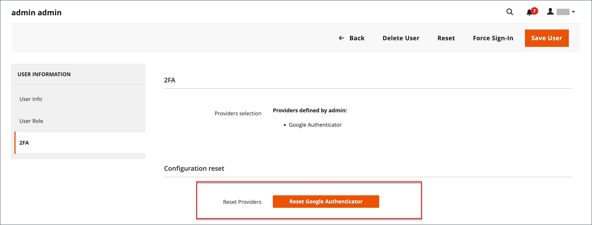

# 이중 인증 관리

에 로그인할 수 없는 사용자 _관리자_ 이중 인증(2FA)을 사용하면 문제를 동기화하거나 해결할 수 있습니다. 계정과 연결된 인증자를 재설정할 수도 있습니다. 재설정하면 사용자가 다시 로그인하고 필요한 인증자를 다시 구성해야 합니다.

2FA로 로그인하는 데 문제가 있는 경우 다음 사항을 고려하십시오.

- 일부 모바일 앱에는 동기화 옵션이 포함되어 있습니다. 이 옵션은 앱과 서버를 다시 연결하고 장치와 서버의 시간 설정을 동기화합니다.
- 장치를 취소하거나 인증자를 재설정하면 사용자가 연결할 수 있습니다.
- Adobe Commerce 또는 Magento Open Source 설치를 위해 웹 캐시 및 쿠키를 지우는 것도 도움이 될 수 있습니다. Google과 같은 인증자는 생성된 쿠키를 사용하여 액세스 및 기간을 저장합니다. 특정 브라우저 및 스토어 도메인에 대한 쿠키를 지웁니다.
- 쿠키를 차단하면 와 같은 일부 인증자가 방지됩니다. [!DNL Google Authenticator]확인 프로세스 완료 시까지 사용할 수 있습니다. 브라우저에 Adobe Commerce 설치에 대한 쿠키를 허용하는 규칙을 추가합니다.

명령줄에서 인증자를 재설정하고 고급 문제 해결 정보를 보려면 을 참조하십시오. [이중 인증](https://developer.adobe.com/commerce/testing/functional-testing-framework/two-factor-authentication/) 개발자 설명서에서 참조하십시오.

**_사용자 계정에 대한 인증자를 재설정하려면 다음을 수행하십시오._**

>[!NOTE]
>
>다른 사용자에 대해 2FA 공급자를 재설정하려면 _관리자_ 포함 `All` 권한 또는 보유 `Custom` 이(가) 있는 내 역할에 대한 권한 [!UICONTROL System] > [!UICONTROL Permissions] > [!UICONTROL Two Factor Auth] 및 [!UICONTROL System] > [!UICONTROL Permissions] > [!UICONTROL All Users] 선택됨. 자세한 내용은 다음을 참조하십시오. [사용자 역할](permissions-user-roles.md).

1. 다음에서 _관리자_ 사이드바, 이동 **[!UICONTROL System]** > _[!UICONTROL Permissions]_>**[!UICONTROL All Users]**.

1. 사용자를 선택하고 편집 모드에서 계정을 엽니다.

1. 아래로 스크롤하여 _[!UICONTROL Current User Identity Verification]_을(를) 섹션에 입력하고 암호를 입력합니다.

1. 왼쪽 패널에서 **[!UICONTROL 2FA]**.

1. 다음에서 _[!UICONTROL Configuration reset]_섹션, 클릭&#x200B;**[!UICONTROL Reset]**및&#x200B;**[!UICONTROL OK]**확인할 수 있습니다.

   {width="600" zoomable="yes"}

   사용자가 필요한 2FA 메서드를 계정에 복원하려는 경우 다음에서 각각 다시 구성해야 합니다. _로그온_ 페이지를 가리키도록 업데이트하는 중입니다.

1. 완료되면 다음을 클릭하십시오. **[!UICONTROL Save User]**.
