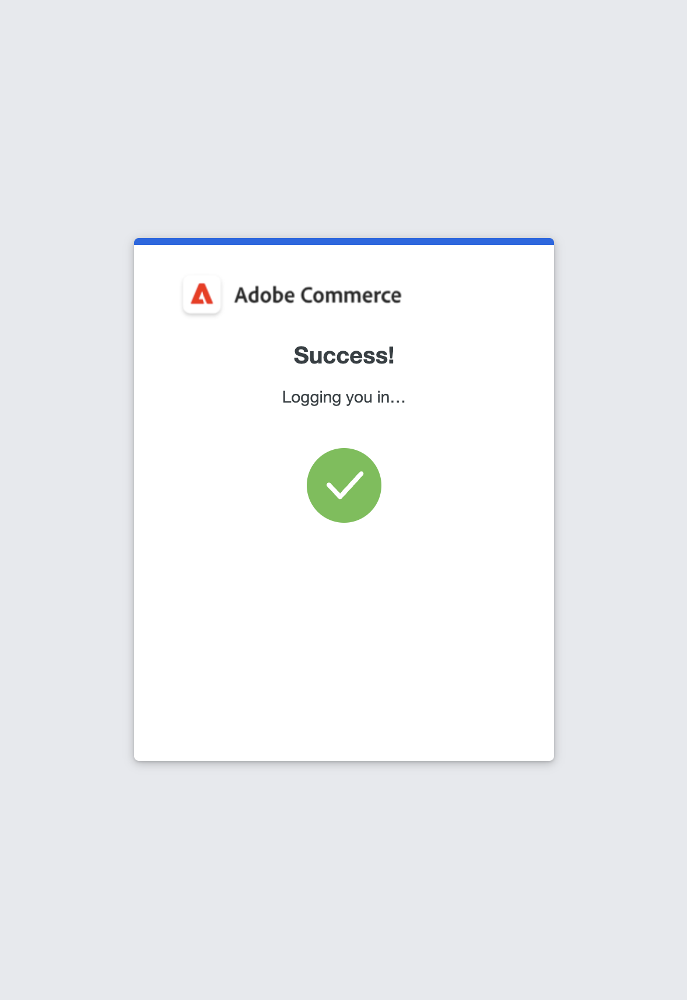

# 사용자 계정에 대한 2단계 인증 설정

이 지침은 Adobe Commerce 또는 Magento Open Source에 처음 로그인하는 동안 이중 인증을 설정하는 방법과 다음 앱 및 장치를 사용하여 신원을 인증하는 방법을 보여 줍니다.

자세한 지침은 [관리자 로그인](../getting-started/admin-signin.md)을 참조하세요.

>[!NOTE]
>
>[!DNL Adobe Identity Management Services]&#x200B;(IMS) 인증을 사용하도록 설정한 저장소에 기본 Adobe Commerce 및 Magento Open Source 2FA가 사용하지 않도록 설정되어 있습니다. Adobe 자격 증명으로 Commerce 인스턴스에 로그인한 관리자는 많은 관리 작업에 대해 다시 인증할 필요가 없습니다. Adobe IMS는 관리자 가 현재 세션에 로그인할 때 인증을 처리합니다. [[!DNL Adobe Identity Management Service] (IMS) 통합 개요](../getting-started/adobe-ims-integration-overview.md)를 참조하십시오.

## [!DNL Google Authenticator]

### 1단계: [!DNL Google Authenticator] 설정

1. 계정 자격 증명을 입력하고 _관리자_&#x200B;에 로그인하십시오. QR 코드와 함께 새 인증자 화면이 나타납니다.

1. 모바일 장치에서 **[!UICONTROL Google Authenticator]** 앱을 엽니다.

1. 더하기 기호( **+** )를 클릭하여 항목을 추가하고 스마트 폰의 카메라로 스캔할 QR 코드와 함께 빨간색 상자를 정렬합니다.

1. 휴대폰에서 QR 코드를 인식하고 항목을 추가하면 _관리자_ **[!UICONTROL Authenticator code]** 필드에 6자리 코드를 입력하세요.

1. 완료되면 **[!UICONTROL Confirm]**&#x200B;을(를) 클릭합니다.

   {width="300"}

### 2단계: [!DNL Google Authenticator]&#x200B;(으)로 로그인

1. 계정 자격 증명을 입력하고 Commerce _관리자_&#x200B;에 로그인하십시오.

   {width="300"}

1. 모바일 장치에서 [!DNL Google Authenticator]을(를) 엽니다.

1. 메시지가 표시되면 6자리 인증 코드를 입력합니다.

1. 향후 로그인을 위해 인증을 저장하려면 **[!UICONTROL Trust this device, do not ask again]** 확인란을 선택하십시오.

1. 완료되면 **[!UICONTROL Confirm]**&#x200B;을(를) 클릭합니다.

## [!DNL Duo Security]

[!DNL Duo]은(는) 무료 평가판을 제공하며 계정에 연결된 사용자 수에 따라 요금을 부과합니다. [지침에 따라 계정을 설정하고 앱을 다운로드하세요](https://duo.com/product/multi-factor-authentication-mfa/duo-mobile-app).

### 1단계: [!DNL Duo Security] 설정

1. 계정 자격 증명을 입력하고 _관리자_&#x200B;에 로그인하십시오.

1. [!DNL Duo] 설정 페이지가 나타나면 **[!UICONTROL Get Started]**&#x200B;을(를) 클릭하고 다음을 수행합니다.

   {width="300"}

1. 옵션을 선택합니다. Touch ID, Duo Mobile, 보안 키 또는 전화 번호를 선택할 수 있습니다. 이 예에서는 듀오 모바일 또는 전화 번호 옵션을 보여 줍니다.

1. 메시지가 표시되면 전화 번호를 입력하고 **[!UICONTROL Continue]**&#x200B;을(를) 클릭합니다.

   전화 번호에 대한 암호를 보내고 확인하여 소유권을 확인합니다.

1. 휴대폰 유형에 대해 [!DNL Duo Mobile]을(를) 설치하라는 메시지가 표시되면 **[!UICONTROL I have Duo Mobile]**&#x200B;을(를) 클릭합니다.

1. [!DNL Duo Mobile]을(를) 열고 QR 코드를 스캔하여 인증자와 Adobe Commerce을 동기화합니다. 활성화가 완료되면 확인 표시가 나타납니다.

1. 필요한 경우 장치를 더 추가하거나 건너뛸 수 있습니다. 이제 설정이 완료되었으며 Duo로 로그인할 수 있습니다.

   {width="300"}

### 2단계: [!DNL Duo Security]&#x200B;(으)로 로그인

다음 예제에서는 `Ask me to choose an authenticator method`에 대한 옵션을 보여 줍니다.

1. 로그인하라는 메시지가 표시되면 _관리자_ 자격 증명을 입력하여 로그인합니다.

   {width="300"}

1. Duo로 로그인 을 선택하여 Duo 모바일 앱에서 푸시 알림을 받거나, Touch ID로 로그인하거나, 설정 중에 구성한 다른 옵션을 진행합니다.

1. Duo 앱/Touch ID/문자 메시지의 요청을 승인하면 성공적으로 로그인됩니다.

   {width="300"}

## [!DNL Authy]

[!DNL Authy]이(가) 앱 및 서비스를 사용자에게 무료로 제공합니다. 해당 지침에 따라 디바이스 또는 브라우저용 앱을 다운로드하여 설정합니다. 자세한 내용은 [[!DNL Authy] 설명서](https://authy.com/features/setup/)를 참조하세요.

### 1단계: 인증 설정

1. 계정 자격 증명을 입력하고 _관리자_&#x200B;에 로그인하십시오.

   ![[!DNL Authy] 등록](./assets/storefront-2fa-authy-auth.png){width="300"}

1. Authy에 직접 등록하라는 메시지가 표시되면 다음을 수행합니다.

   - 국가를 선택합니다.

   - 전화 번호를 입력합니다.

   - **[!UICONTROL Verification method]**: `SMS` 또는 `Call Me` 선택

   **[!UICONTROL Continue]**&#x200B;을(를) 클릭합니다. SMS 문자 또는 전화를 통해 휴대폰으로 메시지를 보냅니다.

1. 받은 인증 코드를 입력하고 **[!UICONTROL Verify]**&#x200B;을(를) 클릭합니다.

1. 완료되면 **[!UICONTROL Confirm]**&#x200B;을(를) 클릭합니다.

   ![[!DNL Authy] 확인 코드](./assets/storefront-2fa-authy-verify.png){width="300"}

### 2단계: [!DNL Authy]&#x200B;(으)로 로그인

1. 계정 자격 증명을 입력하고 _관리자_&#x200B;에 로그인하십시오.

   ![[!DNL Authy] - 로그인](./assets/storefront-2fa-authy-access.png){width="300"}

1. 다음 방법 중 하나를 선택하여 인증합니다.

   - `Use one touch` — [!DNL Authy] 앱에 알림을 보냅니다. 앱에서 액세스 권한을 수락합니다.
   - `Use authy token` — [!DNL Authy] 앱의 코드를 입력하라는 메시지가 표시됩니다.

1. 로그인에 문제가 있는 경우 코드를 받는 데 사용할 방법을 선택하십시오. _관리자_&#x200B;에 액세스하기 위해 받은 코드를 입력하세요.

   앱에는 다음과 같은 추가 응급 방법이 포함되어 있습니다.

   - `Send me a code via SMS` — 구성된 모바일 장치로 텍스트 SMS 메시지가 전송됩니다.
   - `Send me a code via phone call` — 사용자가 코드가 있는 전화를 받습니다.

   계정이 확인되고 열립니다.

## U2F([!DNL Yubikey] 및 기타 장치)

솔루션 공급자의 지침에 따라 U2F 장치를 구성합니다. 자세한 내용은 공급업체 설명서를 참조하십시오(예: [!UICONTROL Yubico]의 [[!DNL YubiKey]](https://support.yubico.com/hc/en-us/articles/360013790339-Getting-Started-with-Your-YubiKey)).

1. 계정 자격 증명을 입력하고 _관리자_&#x200B;에 로그인하십시오.

   {width="300"}

1. 키에 있는 버튼을 누르세요

   인증이 즉시 트리거되고 _관리자_&#x200B;를 엽니다.

1. **[!UICONTROL U2F key]**&#x200B;을(를) 컴퓨터의 USB 포트에 삽입합니다.
