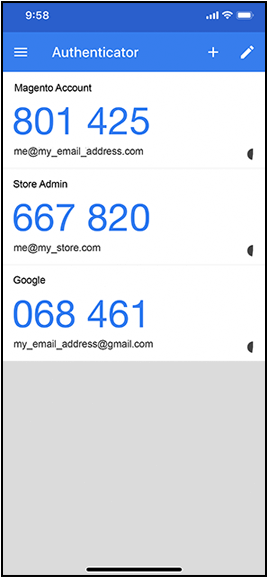

# 이중 인증(2FA)

Adobe Commerce 또는 Magento Open Source 설치용 Commerce _관리자_&#x200B;는 스토어, 주문 및 고객 데이터에 대한 액세스를 제공합니다. 데이터에 대한 무단 액세스를 방지하기 위해 _관리자_&#x200B;에 로그인하려는 모든 사용자는 ID를 확인하기 위해 인증 프로세스를 완료해야 합니다.

>[!NOTE]
>
>이 2단계 인증(2FA) 구현은 _관리자_&#x200B;에만 적용되며 고객 계정에는 사용할 수 없습니다. Commerce 계정을 보호하는 2단계 인증에는 별도의 설정이 있습니다. 자세한 내용을 보려면 [Commerce 계정 보안](../getting-started/commerce-account-secure.md)(으)로 이동하세요.

2단계 인증이 널리 사용되고 있으며 동일한 앱에서 서로 다른 웹 사이트에 대한 액세스 코드를 생성하는 것이 일반적입니다. 이 추가 인증은 사용자만 사용자 계정에 로그인할 수 있도록 합니다. 암호를 분실하거나 봇이 추측하는 경우 2단계 인증을 통해 보호 계층이 추가됩니다. 예를 들어 Google Authenticator를 사용하여 스토어 관리자, Commerce 계정 및 Google 계정에 대한 코드를 생성할 수 있습니다.

{width="300"}

Adobe Commerce은 여러 공급자의 2FA 메서드를 지원합니다. 일부는 사용자가 본인 확인을 위해 로그인 시 입력하는 일회성 비밀번호(OTP)를 생성하는 앱 설치가 필요하다. 범용 제2 인자(U2F) 디바이스는 키 포브와 유사하고 신원을 확인하기 위해 고유 키를 생성한다. 다른 장치는 USB 포트에 삽입되면 ID를 확인합니다. 저장소 관리자는 사용자 ID를 확인하기 위해 사용 가능한 2FA 메서드 중 하나 이상을 요구할 수 있습니다. 2FA 구성은 Adobe Commerce 설치와 연결된 모든 웹 사이트 및 스토어에 적용됩니다.

사용자가 _관리자_&#x200B;에 처음 로그인할 때 필요한 각 [2FA](../configuration-reference/security/2fa.md) 메서드를 설정하고 연결된 앱 또는 장치를 사용하여 ID를 확인해야 합니다. 이 초기 설정 후 사용자는 로그인할 때마다 구성된 방법 중 하나를 사용하여 인증해야 합니다. 각 사용자의 2FA 정보는 _관리자_ 계정에 기록되며 필요한 경우 [재설정](security-two-factor-authentication-manage.md)될 수 있습니다. 로그인 프로세스에 대해 자세히 알아보려면 [_관리자_ 로그인](../getting-started/admin-signin.md)(으)로 이동하세요.

>[!NOTE]
>
>IMS(Adobe Identity Management Services) 인증을 활성화한 스토어에는 기본 Adobe Commerce 및 Magento Open Source 2FA가 비활성화되어 있습니다. Adobe 자격 증명으로 Commerce 인스턴스에 로그인한 관리자는 많은 관리 작업에 대해 다시 인증할 필요가 없습니다. Adobe IMS는 관리자 가 현재 세션에 로그인할 때 인증을 처리합니다. [Adobe IMS(Identity Management 서비스) 통합 개요](https://experienceleague.adobe.com/docs/commerce-admin/start/admin/ims/adobe-ims-integration-overview.html?lang=ko)를 참조하세요.

이 [비디오 데모](https://video.tv.adobe.com/v/339104?quality=12&learn=on)를 통해 관리자의 2단계 인증에 대한 개요를 볼 수 있습니다.

## 필요한 2FA 공급자 구성

1. _관리자_ 사이드바에서 **[!UICONTROL Stores]** > _[!UICONTROL Settings]_>**[!UICONTROL Configuration]**(으)로 이동합니다.

1. 왼쪽 패널에서 **[!UICONTROL Security]**&#x200B;을(를) 확장하고 **[!UICONTROL 2FA]**&#x200B;을(를) 선택합니다.

1. _[!UICONTROL General]_&#x200B;섹션에서 사용할 공급자를 선택합니다.

   | 공급자 | 함수 |
   |--- |--- |
   | [!UICONTROL Google Authenticator] | 사용자 인증을 위해 애플리케이션에서 일회용 암호를 생성합니다. |
   | [!UICONTROL Duo Security] | SMS 및 푸시 알림을 제공합니다. |
   | [!UICONTROL Authy] | 시간에 따라 달라지는 6자리 코드를 생성하고 SMS 또는 음성 호출 2FA 보호 또는 토큰을 전달합니다. |
   | [!UICONTROL U2F Devices (Yubikey and others)] | 실제 장치를 사용하여 인증합니다(예: [[!DNL YubiKey]](https://www.yubico.com/)). |

   여러 메서드를 선택하려면 Ctrl 키(PC) 또는 Command 키(Mac)를 누른 채 각 항목을 클릭합니다.

1. 필요한 각 2FA 메서드에 대해 [설정](../configuration-reference/security/2fa.md)을(를) 완료합니다.

   {width="600" zoomable="yes"}

1. 완료되면 **[!UICONTROL Save Config]**&#x200B;을(를) 클릭합니다.

   사용자가 _관리자_&#x200B;에 처음 로그인할 때 필요한 각 2FA 메서드를 설정해야 합니다. 이 초기 설정 후에는 로그인할 때마다 구성된 방법 중 하나를 사용하여 인증해야 합니다.

## 2FA 공급자 설정

필요한 각 2FA 메서드에 대한 설정을 완료합니다.

### Google

로그인 중에 OTP(일회용 암호)를 사용할 수 있는 기간을 변경하려면 **[!UICONTROL Use system value]** 확인란의 선택을 취소하십시오. **[!UICONTROL OTP Window]**&#x200B;을(를) 유효하게 만들 시간(초)을 입력하십시오.

{width="600" zoomable="yes"}

>[!NOTE]
>
>Adobe Commerce 2.4.7 이상에서는 OTP 창 구성 설정이 관리자의 OTP(일회성 암호)가 만료된 후 시스템이 수락한 시간(초)을 제어합니다. 이 값은 30초 미만이어야 합니다. 시스템 기본 설정은 `29`입니다.   버전 2.4.6에서 OTP 창 설정은 유효한 과거 및 향후 OTP 코드 수를 결정합니다. 값 `1`은(는) 현재 OTP 코드와 과거의 코드 하나, 미래의 코드 하나가 지정된 시점에 계속 유효함을 나타냅니다.

### [!DNL Duo Security]

Duo Security 계정에서 다음 자격 증명을 입력합니다.

- 클라이언트 ID
- 클라이언트 암호
- 통합 키
- 비밀 키
- API 호스트 이름

{width="600" zoomable="yes"}

### [!DNL Authy]

1. [!DNL Authy] 계정의 API 키를 입력하십시오.

1. 인증 중에 표시되는 기본 메시지를 변경하려면 **[!UICONTROL Use system value]** 확인란의 선택을 취소하십시오. 그런 다음 표시할 **[!UICONTROL OneTouch Message]**&#x200B;을(를) 입력하십시오.

   {width="600" zoomable="yes"}

### U2F 장치([!DNL Yubikey] 외)

저장소 도메인은 인증 프로세스 중에 기본적으로 사용됩니다. 인증 문제에 사용자 지정 도메인을 사용하려면 **[!UICONTROL Use system value]** 확인란의 선택을 취소하십시오. **[!UICONTROL WebAPi Challenge Domain]**&#x200B;을(를) 입력하십시오.

{width="600" zoomable="yes"}
