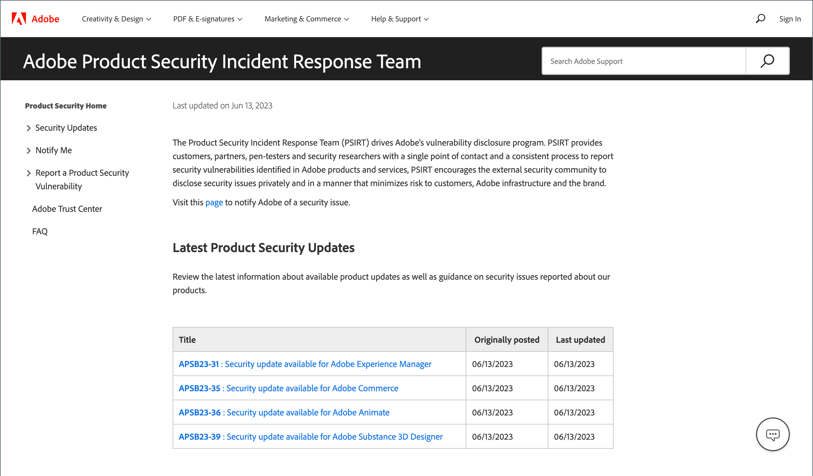

# 보안

저장소 보안 및 데이터 보안 유지 관리에는 여러 가지 방법이 있습니다.

- [이중 인증 설정](security-two-factor-authentication.md)
- [CAPTCHA](security-captcha.md) 또는 [reCAPTCHA](security-google-recaptcha.md) 구현
- Adobe Commerce 또는 Magento Open Source 설치에서 각 도메인에 대해 [보안 검사](security-scan.md)를 설정합니다.

>[!NOTE]
>
>[!DNL Adobe Identity Management Services](IMS) 인증을 사용하도록 설정한 저장소에 기본 Adobe Commerce 및 Magento Open Source 2FA가 사용하지 않도록 설정되어 있습니다. Adobe 자격 증명으로 Commerce 인스턴스에 로그인한 관리자는 많은 관리 작업에 대해 다시 인증할 필요가 없습니다. Adobe IMS는 관리자 가 현재 세션에 로그인할 때 인증을 처리합니다. [[!DNL Adobe Identity Management Service] (IMS) 통합 개요](../getting-started/adobe-ims-integration-overview.md)를 참조하십시오.

잠재적인 취약점에 대한 최신 뉴스를 보고, Adobe 보안 알림에 등록하고, Adobe 트러스트 센터에 액세스하려면 [보안 센터](https://helpx.adobe.com/security.html){:target=&quot;_blank&quot;}를 방문하십시오.

{width="700" zoomable="yes"}

보안 모범 사례에 대한 자세한 내용은 _구현 플레이북_&#x200B;에서 [Commerce 사이트 및 인프라 보호](https://experienceleague.adobe.com/docs/commerce-operations/implementation-playbook/best-practices/launch/security-best-practices.html)를 참조하십시오.

## 보안 작업 계획

Adobe Commerce 또는 Magento Open Source 사이트가 손상된 것으로 의심되는 경우 지체 없이 이 작업 계획을 따르십시오.

1. **진단**: 검사를 실행하여 Commerce 스토어의 보안 상태를 설정합니다. Commerce [보안 검색](security-scan.md)은(는) 알려진 보안 위험 및 맬웨어에 대해 Commerce 사이트를 모니터링하고 보안 알림을 받을 수 있도록 Adobe에서 제공하는 무료 서비스입니다.

1. **정리**: [자격 있는 컨설턴트](https://solutionpartners.adobe.com/s/directory/?partner_type=1) 또는 온라인 서비스를 사용하여 모든 악성 코드의 사이트를 정리합니다. 일부 Commerce 커뮤니티 구성원은 [[!DNL Sucuri Website Malware Removal]](https://sucuri.net/website-antivirus/malware-removal)을(를) 추천합니다. `/media` 폴더에서 남은 실행 코드를 확인합니다. 알 수 없는 모든 관리자 사용자를 제거하고 모든 관리자 암호를 재설정합니다.

1. **Protect**: Commerce 설치를 최신 릴리스로 유지하십시오. 이전 버전을 사용하는 경우 모든 보안 패치를 사용할 수 있게 되면 적용합니다. [Commerce 보안 모범 사례](https://www.adobe.com/content/dam/cc/en/trust-center/ungated/whitepapers/experience-cloud/adobe-commerce-best-practices-guide.pdf)를 검토하고 따릅니다. [Commerce 보안 경고](https://www.adobe.com/subscription/adbeSecurityNotifications.html)를 구독하세요.

1. **보고서**: Commerce에서 특정 취약성을 발견했다고 생각되면 [Adobe 문제를 열고](https://hackerone.com/adobe?type=team) 기술 세부 정보를 포함하십시오.

1. **업그레이드**: 연중무휴 24시간 지원을 통해 안심하고 [클라우드 아키텍처의 Adobe Commerce](https://business.adobe.com/products/magento/cloud-delivery.html)(으)로 업그레이드할 수 있습니다.
